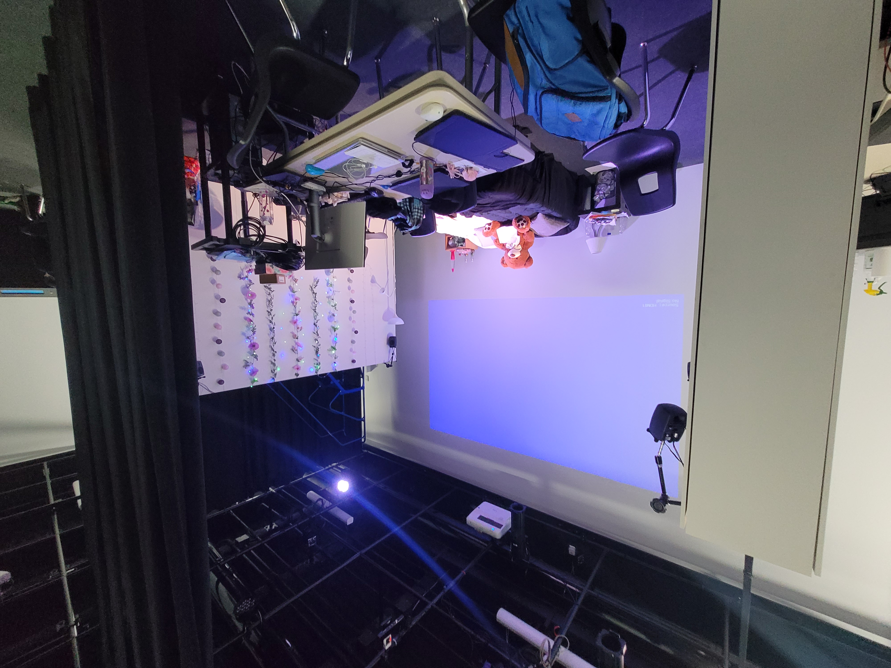

## Titre 

Chère Sasha

## Créatrices

Trish Nguyen, Angelina De Silva Jeca, Karine Cormier et Sabrina Kayani

## Moyen utilisé pour aborder le thème du *temps* 

Le thème du temps est mis en valeur en créant un contraste générationnel. Durant l'exposition, le public est amené à voir la vie de Sasha lorsqu'elle était adolescente et où elle se sentait incomprise à cause de son orientation sexuel puis sa vie adulte séparément. Montrer ces deux étapes de vie ont pour but de mettre en avant les conflits ntergénérationnels possibles entre les parents et leurs enfants. 

## Ambiance

L'ambiance créée par le décor de la chambre de Sasha lorsqu'elle est adolescente montre à quel point elle se fait négliger par ses parents et montre au public l'état de sa santé mentale qui est mauvaise. Le bordel présent dans la chambre amplifie le sentiment d'inconfort face à son état. Chaque objet présent est de couleur sombre et la trame sonore composée de bruits de tonerre et de respirations fortes rajoute un côté de solitude à l'exposition. Alors que l'ambiance créée par la chambre de Sasha lorsqu'elle est adulte est complètement différente. La trame sonore composée de rire et de discussion met le public dans un environnememt amical et beaucoup plus chaleureux. L'état de la chambre qui est bien rangé et composée de couleurs épurées montre que sa vie va beaucoup mieux et qu'elle la reprise en main. 

## Installation en cours dans les studios (photos à l'appui)

L'installation est composée d'une pièce divisé en deux avec un grand lit divisé également en deux. La partie illuminée de la pièce représente la vie adulte de Sasha tandis que la partie sombre sa vie d'adolescente. Chaque espace contient des objets qui correspondent à l'ambiance de l'époque spécifiée. Pour ce qui est du son, quatre hauts-parleurs sont placés sur les murs ; deux du côté gauche et deux du côté droit. Pour ce qui est de la lumière, il y a des guirlandes de lumière accrochées du côté droit de l'installation ainsi que des projecteurs situés dans les herses. Pour finir, un ordinateur sera mis à la disposition des intéracteurs afin qu'ils puissent écrire un message d'encouragement à Sasha.

## Schéma de l'installation prévue (insérer le schéma de plantation, avec la source)

Ces images sont tirées du Github de Chère Sasha. 

## Ce qui sera attendu de nous en tant qu'interactrice, lorsque nous ferons l'expérience de l'installation

Dans ce projet, l'interacteur doit écouter la vidéo de Sasha, puis aller écrire un message d'encouragement à celle-ci sur l'oridnateur fourni à ces fins.

## 3 cours du programme qui nous semblent incontournables pour avoir les compétences pour créer ce projet 

 - Conception vidéo
 - Conception sonore
 - Conception de projet multimédia
