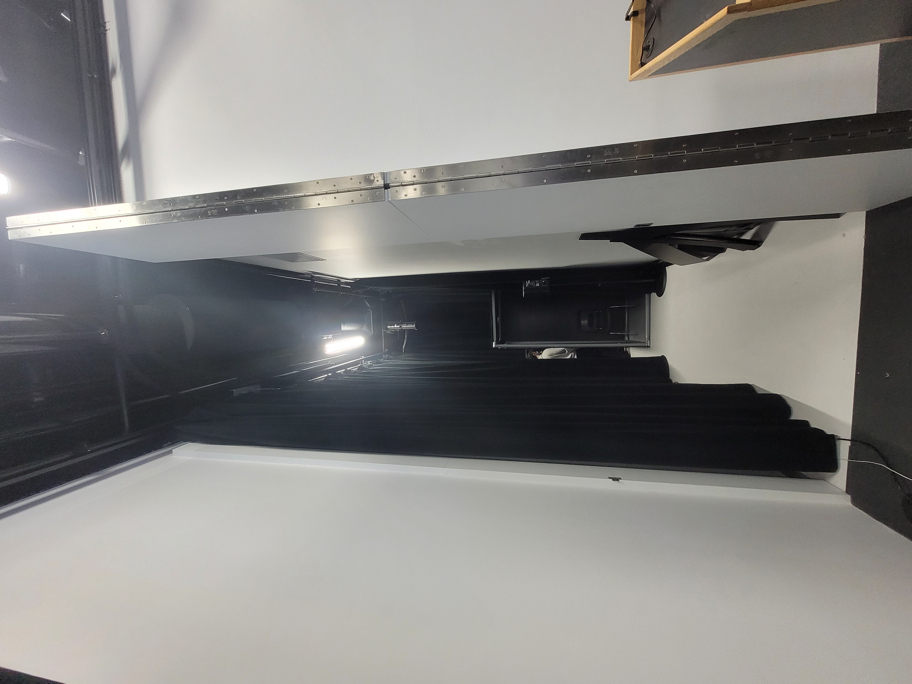
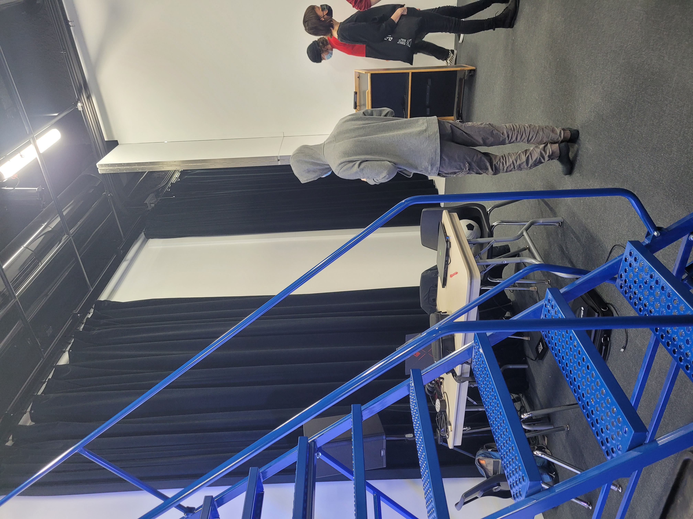
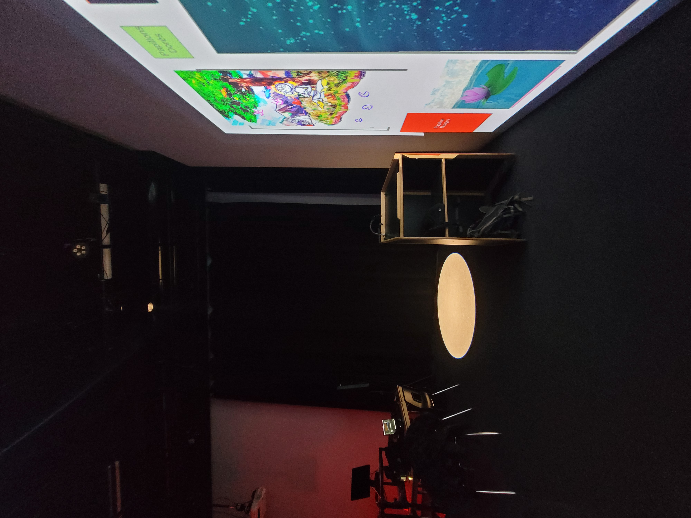
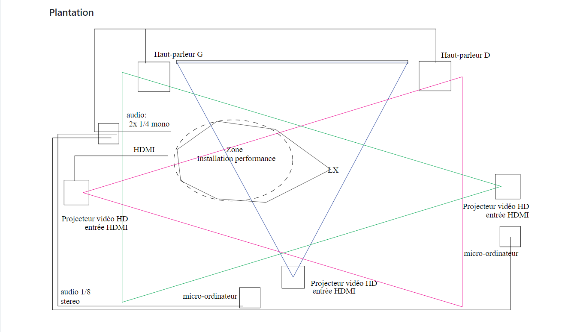
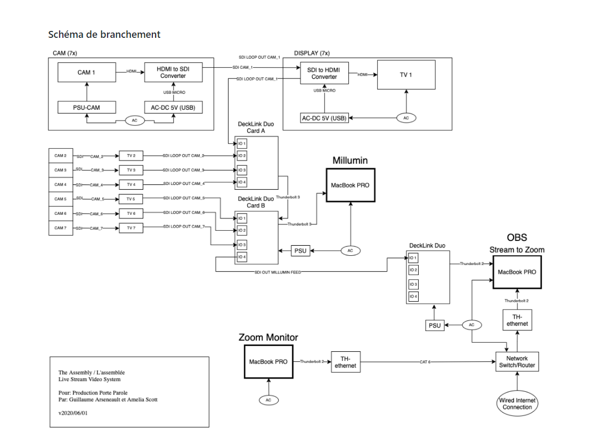

## Titre 

3 minutes

## Créateurs

Naoufal Bensaiad, Jérémie Lévesque et Samuel Poulin 

## Moyen utilisé pour aborder le thème du *temps* 

Le thème du temps est utilisé pour montrer que le temps passe plus vite lorsqu'on s'amuse et beaucoup plus lentement lorsqu'on se sent seul ou triste. Leur concept est d'abord représenté à l'aide d'un jeu VR. En effet, la première partie consiste à jouer pendant trois minutes à un jeu de ballon chasseur contre des cibles modélisées par le casque VR. Ainsi, l'amusement ressenti par l'utilisateur, grâce à ce jeu, lui procure la sensation que le temps passe plus vite. Par la suite, ce dernier est amené à passer trois minutes dans un casier construit dans l'octophonie qui semblent, selon l'interacteur, beaucoup plus longues. Cela montre réellement le contraste de notre vision du temps entre des évènements amusants et ceux angoissants.

## Ambiance

Au début de l'expérience, l'utilisateur ressent du plaisir et s'amuse en jouant au ballon chasseur en réalité virtuelle. Il se sent heureux et donc en sécurité. Lorsque la partie finit, l'interacteur est amené à enlever son casque VR pour se diriger vers le casier situé un peu plus loin. Une fois dans le casier, une ambiance angoissante s'installe. En effet, les lumières s'éteignent et une trame sonore composée d'insultes se dirigent directement vers l'utilisateur afin de simuler une intimidation. Être à l'intérieur du casier donne une impression d'étouffement à l'interacteur qui se reflète à de la claustrophobie. 

## Installation en cours dans les studios 

Dans les herses, on trouve un projecteur qui renvoie une lumière puissante pour ainsi créer un cercle de lumière au sol. Le casier se trouve dans la petite pièce dissimulée à droite de la station dédiée à la réalité virtuelle. À l'intérieur se trouve un détecteur de mouvement qui permet d'aviser lorsque l'interacteur s'approche de la deuxième partie du projet. De plus, au niveau du son, c'est une expérience octophonique. À l'extérieur du casier se trouve quatre hauts parleurs ainsi que quatre autres à l'intérieur de celui-ci. La première partie de l'expérience se fait à l'aide d'un casque VR et de deux manettes. 

**Image de la pièce menant au casier**

**Image de l'espace réservé au projet 2**

**Image de l'endroit où se déroulera l'expérience VR**

## Schéma de l'installation prévue 

Ces images sont tirées du Github de 3 minutes. 

## Ce qui sera attendu de nous en tant qu'interactrice, lorsque nous ferons l'expérience de l'installation

Dans ce projet, nous devrons d'abord, pendant trois minutes, jouer au ballon chasseur en réalité virtuelle dans le but de toucher le plus de cibles, puis nous devrons nous diriger vers une petite pièce pour nous enfermer dans un casier durant également trois minutes. 

## 3 cours du programme qui nous semblent incontournables pour avoir les compétences pour créer ce projet 

 - Réalité virtuelle
 - Modélisation 3D
 - Conception sonore

## Références

Github

[Lien vers le Github de 3 minutes](https://github.com/tim-montmorency/66B-modele_de_projet)
