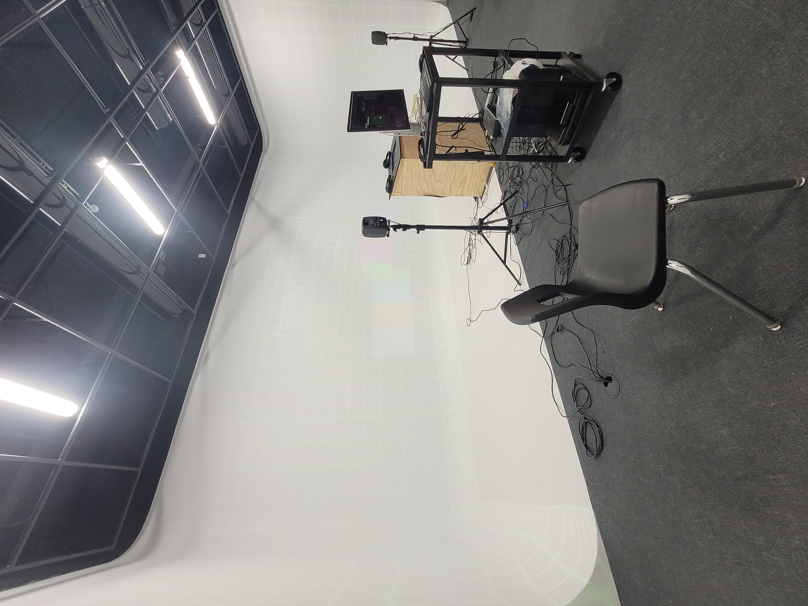
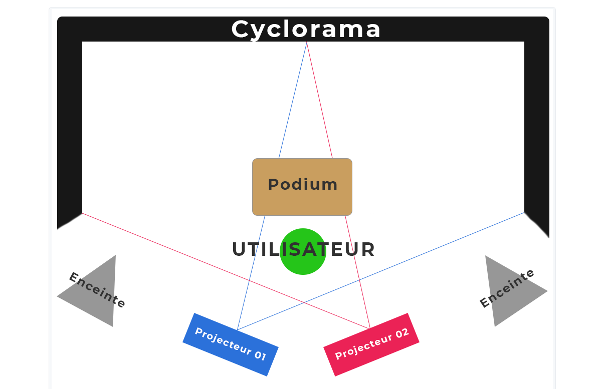
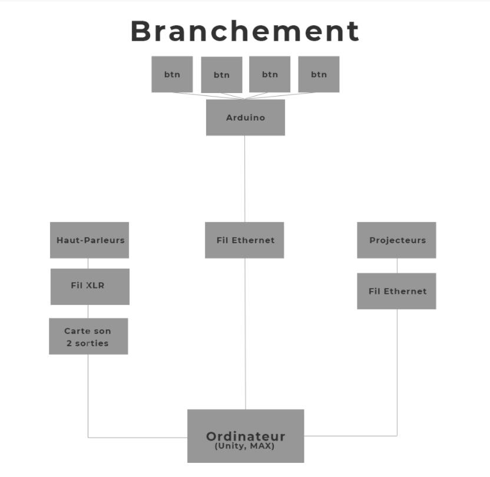

## Titre 

Jeu Temporel

## Créateurs

Raphaël Fillion et Philippe Trudel

## Moyen utilisé pour aborder le thème du *temps* 

Le thème du temps est utilisé afin de sensibiliser l'utilisateur aux dangers des changements climatiques. Plus ce dernier obtient de bonnes réponses, plus l'animateur change de ton et devient déçu, car il ne peut donc prouver à l'interacteur que celui-ci est dans l'erreur. Dans le cas contraire, l'animateur est davantage arrogant et finit par détruire le monde. L'apparence de l'AI change également au fil de l'expérience à l'aide de quatre types de *glitchs* différents.

## Ambiance

L'ambiance au tout début du jeu est festive et colorée afin de faire croire à l'utilisateur qu'il participe à un jeu agréable. Cependant, au fur et à mesure que l'expérience avance, l'ambiance change davantage pour faire ressentir une certaine pression liée aux changements climatiques à l'interacteur. Le changement de comportement ainsi que les *glitchs* incorporés graduellement au visage de l'AI amplifie également cette pression.

## Installation en cours dans les studios 

Au centre de l'installation se trouve un podium où s'affichent les questions et les choix de réponses à répondre grâce aux boutons. Quant au son, il y a deux haut-parleurs sur trépied des deux côtés qui vont diffuser la musique du jeu. Pour ce qui est de l'animateur, il va se déplacer tout le long du cyclorama où un fond personnalisé sera projeté.

## Schéma de l'installation prévue 

Ces images sont tirées du Github de Jeu temporel. 

## Ce qui sera attendu de nous en tant qu'interactrice, lorsque nous ferons l'expérience de l'installation

Dans ce projet, nous devrons nous positionner devant un podium où seront affichées les questions auxquelles il faudra que nous répondions au moyen de boutons situés horizontalement aux choix de réponses. 

## 3 cours du programme qui nous semblent incontournables pour avoir les compétences pour créer ce projet 

 - Espace interactif
 - Conception de projet multimédia
 - Communication graphique
