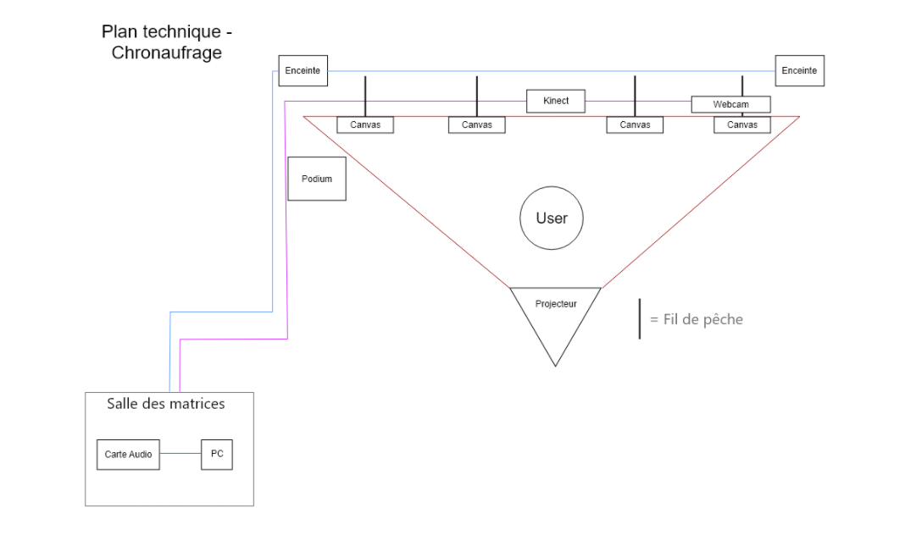
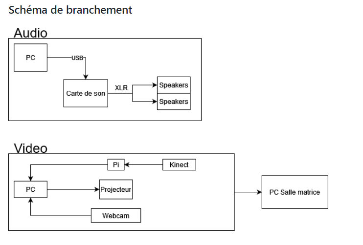

## Titre 

Musée de la vie

## Créateur et créatrices

Olivier Lalonde, Maloney Khim, Sounthida Kong, Rebecca Pilotte et Émilie Fontaine  

## Moyen utilisé pour aborder le thème du *temps* 

## Ambiance

## Installation en cours dans les studios (photos à l'appui)

## Schéma de l'installation prévue (insérer le schéma de plantation, avec la source)

Ses images sont tirées du Github du musée de la vie
## Ce qui sera attendu de nous en tant qu'interactrice, lorsque nous ferons l'expérience de l'installation
Dans ce projet, l'interacteur doit s'approcher des oeuvres pour que le rythme des oeuvres sur le mur change et en reculant, celui-ci va encore une fois changer.

## 3 cours du programme qui nous semblent incontournables pour avoir les compétences pour créer ce projet 
 - Animation 2D
 - Conception de projet multimédia
 - Traitement vidéo
