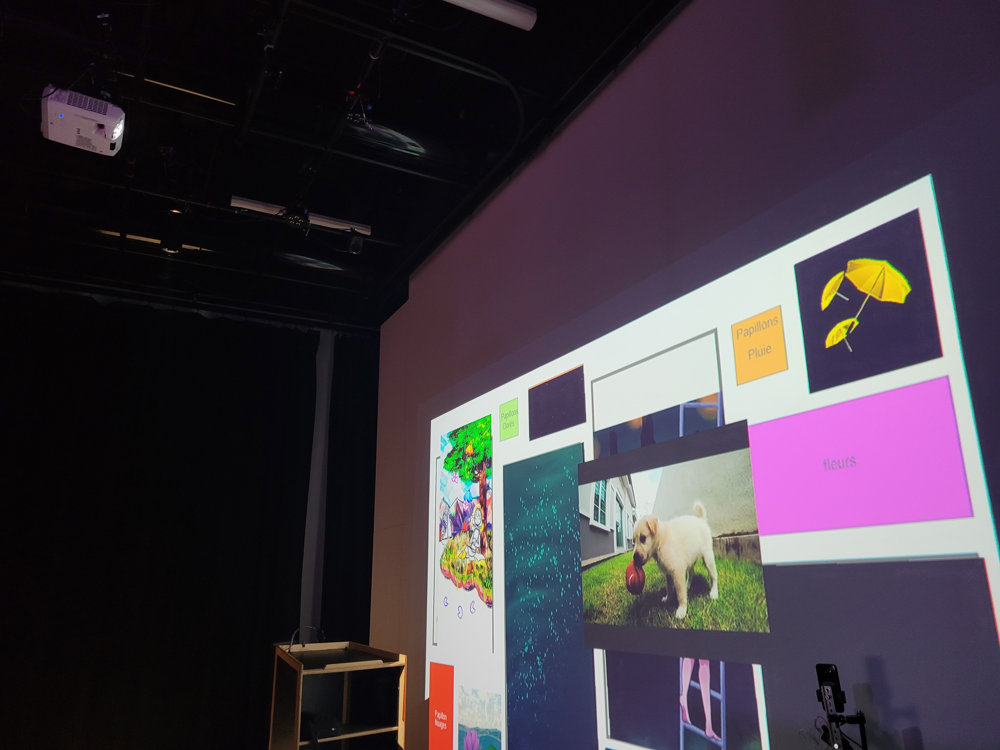

## Titre 

Musée de la vie

## Créateur et créatrices

Olivier Lalonde, Maloney Khim, Sounthida Kong, Rebecca Pilotte et Émilie Fontaine  

## Moyen utilisé pour aborder le thème du *temps* 

Dans l'exposition, le temps est symbolisé par l'eau. Plus l'utilisateur s'approche du cadre, plus l'eau commence à s'agiter. De plus, lorsque l'interacteur se rapproche progressivement des différentes parties de l'exposition, les tableaux commencent à être davantage triste. Cela montre ainsi le temps qui file à toute vitesse dont le personnage des tableaux ne peut rattraper. On nous indique qu'il est important de prendre du temps pour soi, sans quoi le temps nous file entre les doigts et on finit par se noyer, autrement dit, s'enfoncer. À la fin de l'expérience, la fille dans les tableaux ne se sent plus du tout stressée par le public et tout reste relativement calme.

## Ambiance

Étant donné que l'eau est l'élément central de l'exposition, l'ambiance de la trame sonore est dans ce même thème. L'ensemble de l'expérience est assez aquatique. Les premiers tableaux sont plutôt tristes ce qui crée une ambiance assez oppressante, d'autant plus qu'on se sent coupable de faire stresser la fille des tableaux, puisque ses mouvements accélèrent lorsqu'on s'approche d'elle. Quant au dernier tableau, celui-ci témoigne, au contraire, d'une ambiance calme et apaisante. 

## Installation en cours dans les studios 

Il y a d'abord un tapis rouge qui longe le mur afin de permettre à l'utilisateur de suivre le chemin menant à l'observation des différents tableaux exposés. Ce dernier est éclairé par une faible lumière de tout son long. Un projecteur situé sur la herse est utilisé afin d'accrocher sur le mur les divers tableaux. Pour ce qui est du son, deux haut-parleurs sont utilisés pour diffuser les sons ainsi que les musiques nécessaires à l'expérience. Pour finir, en face du mur, se trouve un téléphone soutenu par une sorte de trépied. 

## Schéma de l'installation prévue

Ces images sont tirées du Github de Musée de la vie.

## Ce qui sera attendu de nous en tant qu'interactrice, lorsque nous ferons l'expérience de l'installation

Dans ce projet, nous devrons nous approcher ainsi que nous reculer des oeuvres sur le mur pour que le rythme de ces dernières change. 

## 3 cours du programme qui nous semblent incontournables pour avoir les compétences pour créer ce projet 

 - Animation 2D
 - Conception de projet multimédia
 - Traitement vidéo
