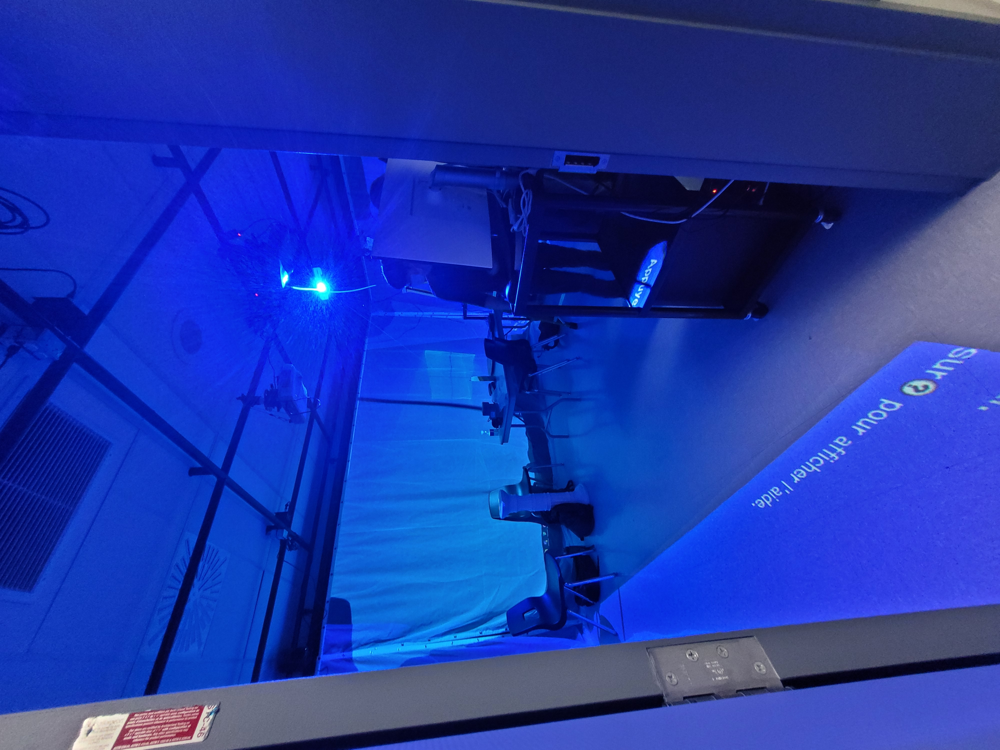
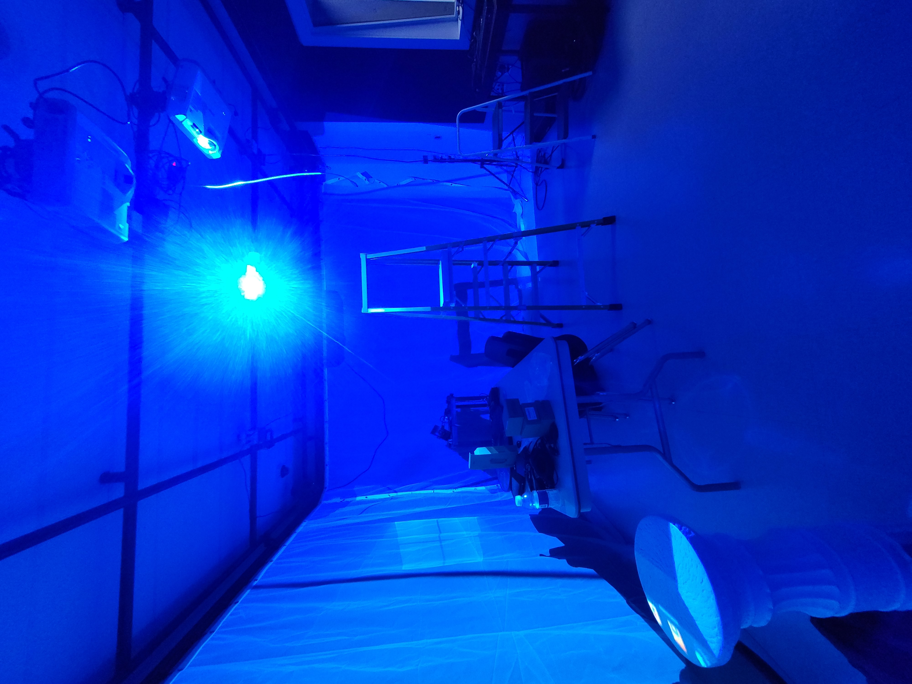
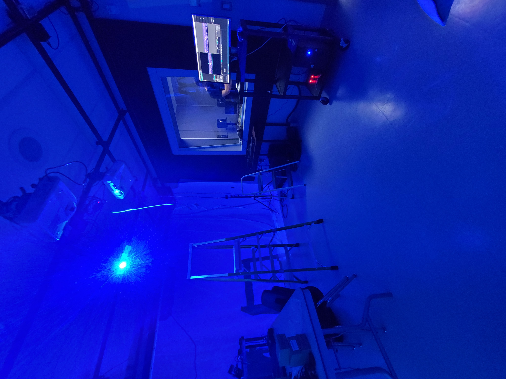
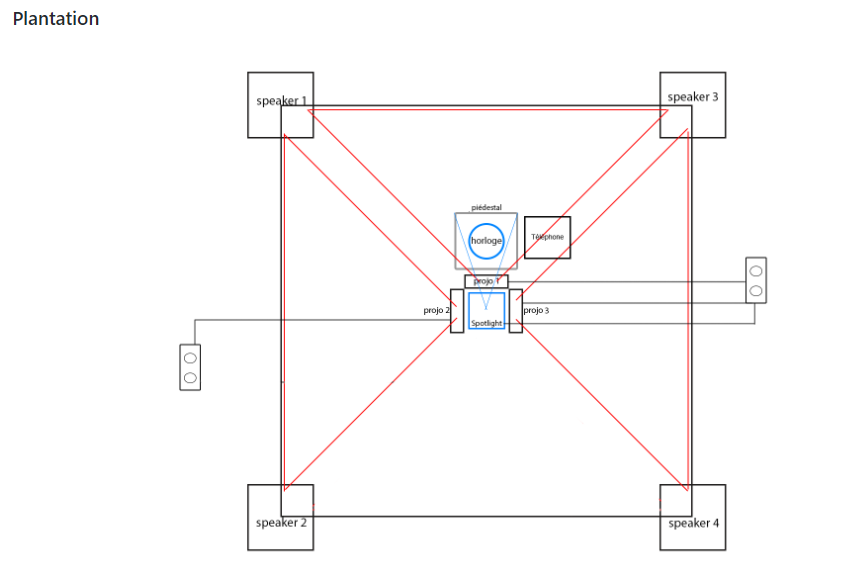
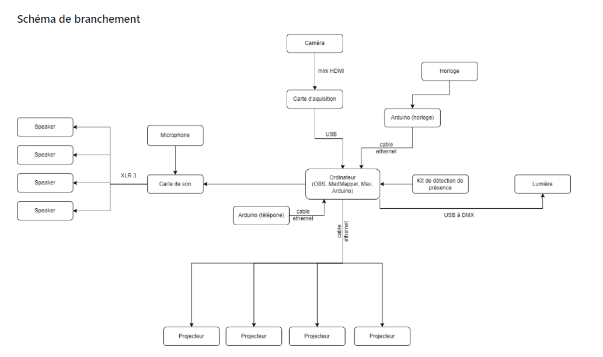

## Titre 

L'horloge de l'apocalyse

## Créateurs 

Maxime Sabourin, Louis-Philippe Gravel, Alexis Lacasse, Tristan Girard-Montpetit et Maxime De Falco

## Moyen utilisé pour aborder le thème du *temps* 

Le thème du temps est abordé principalement en montrant clairement l'impact socio-politique et environnemental durant toute l'expérience. Au début de l'exposition, tout est relativement calme et plus l'horloge avance dans le temps, plus le public est amené à expérimenter des environnements davantage angoissants qui ont pour but de sensibiliser les gens à l'environnement ainsi qu'à comprendre qu'il est essentiel d'agir pour sauver le monde. 

## Ambiance

Les ambiances diffèrent selon l'heure de l'horloge :

1- Scène 1h 

Une ambiance assez calme et reposante accompagnée d'une musique soutenant cet effet. L'interacteur se sent en sécurité et apaisé. 

2- Scène 2h 

Une ambiance très axée sur la nature et les animaux. Ils ont pour but de recréer une ambiance paradisiaque avec une musique dans le même thème. 

3- Scène 3h

Une ambiance préhistorique où l'utilisateur se sent comme dans une sorte de caverne. La musique utilisée réfère à l'époque de la préhistoire. 

4- Scène 4h 

Une ambiance très hivernale où le public se sent comme dans le grand nord avec les vikings. La musique utilisée est de type grégorien. 

5- Scène 5h 

Une ambiance très médiévale où l'interacteur se sent habitant d'un village de la même époque. La musique utilisée est de style moyen-âge.

6- Scène 6h 

Une ambiance qui se rapproche de la Renaissance qui donne l'impression au public d'être en Italie dont la musique utilisée nous rappelle la Renaissance. 

7- Scène 7h 

Une ambiance très industrielle où l'utilisateur est au centre de plusieurs usines et est entouré de pollution. Pour ce qui est de la musique, la trame sonore utilisée est plutôt angoissante. 

8- Scène 8h 

Une ambiance assez moderne où le public se sent comme dans une ruelle inquiétante des années 80. La musique utilisée est très mystérieuse. 

9- Scène 9h 

Une ambiance très axée sur la guerre où l'utilisateur se sent comme en plein combat avec d'autres soldats et la musique utilisée est de type fanfare typique dans l'armée.

10- Scène 10h

Une ambiance assez sombre et angoissante où l'interacteur ne se sent pas du tout en sécurité dont la musique assez lourde vient amplifier cette sensation désirée.

11- Scène 11h 

Une ambiance apocalyptique qui se rapproche de l'enfer qui met l'utilisateur en position de faiblesse et lui fait penser qu'il ne peut plus s'échapper. Une musique sinistre est employée comme trame sonore.

## Installation en cours dans les studios

L'exposition se déroule dans le petit studio qui est complètement insonorisé. Sur les murs sont diffusés les différentes scènes par le projecteur accroché au plafond. Au centre se trouve l'horloge posée sur un piédestal romain et juste à côté se trouve le téléphone qui n'est utile que vers la fin de l'expérience. Au niveau de l'audio, quatre haut-parleurs sont utilisés pour les différentes trames sonores. 

**Image de l'installation**

## Schéma de l'installation prévue 

Ces images sont tirées du Github de L'horloge de l'apocalypse.

## Ce qui sera attendu de nous en tant qu'interactrice, lorsque nous ferons l'expérience de l'installation

Dans ce projet, nous devrons bouger les aiguilles de l'horloge pour se déplacer dans les différents univers et époques présentés. À la fin de l'expérience, une caméra nous filmera pour ainsi le projetter sur les murs de la pièce.

## 3 cours du programme qui nous semblent incontournables pour avoir les compétences pour créer ce projet 

 - Espace interactif
 - Conception sonore
 - Animation 2D

## Références 

Github

[Lien vers le Github de L'horloge de l'apocalypse](https://github.com/MALT5/L-horloge-de-l-apocalypse)

Vidéo de préproduction

[Lien Youtube vers la vidéo de préproduction de L'horloge de l'apocalypse](https://www.youtube.com/watch?v=Ly4eBT3RRIA)
