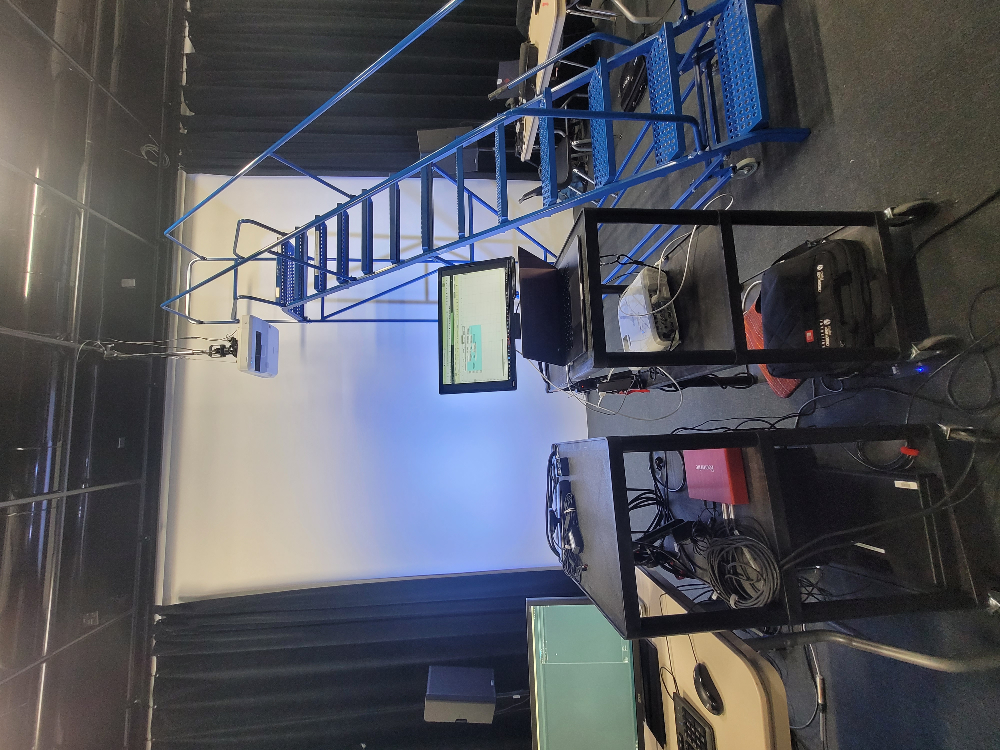
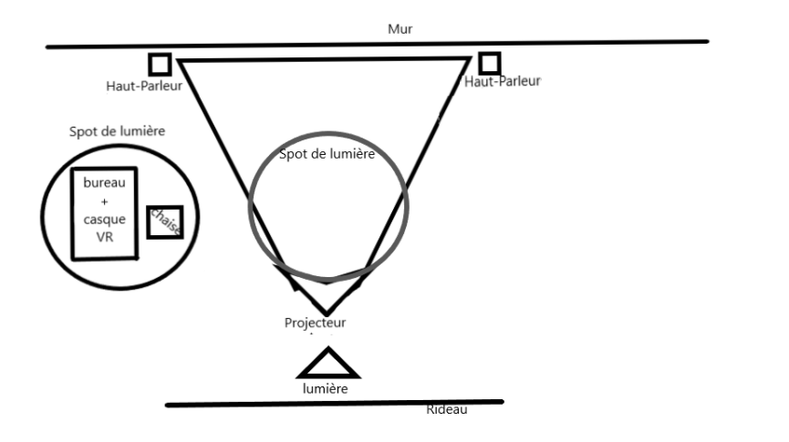
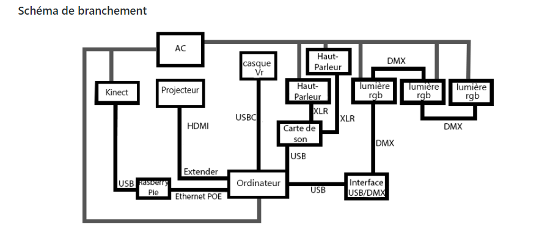

## Titre 

Distorsion collective

## Créateurs 

William Dubois et Ghislain Lacombe

## Moyen utilisé pour aborder le thème du *temps* 

Le thème du temps est utilisé dans cette expérience pour montrer l'impact que les cours en ligne ont eu sur la santé mentale des jeunes pendant le confinement. Au début, tout se passe bien, mais, plus les semaines avancent, plus l'adolescent se sent submergé par toute cette pression. Ainsi, lorsque son stress augmente, l'expérience s'accélère graduellement. 

## Ambiance

Au début, l'ambiance est relativement calme et une musique apaisante joue. L'utilisateur porte le casque VR et voit jouer une vidéo comme s'il était dans un cours en ligne. De plus, une faible lumière bleue est rajouté pour produire un effet sécurisant à l'expérience. En revanche, plus le temps passe, plus l'interacteur commence à ressentir du stress dû à toute son accumulation de devoirs et de travaux le rendant donc davantage dépressif. Par conséquent, l'éclairage bleu est remplacé par un éclairage rouge, puis la trame sonore est remplacée par des battements de cœur qui s'accélèrent progressivement que l'adolescent panique.

## Installation en cours dans les studios 

La plupart de l'expérience se déroule au moyen d'un casque VR. Au niveau des lumières se trouvent différents projecteurs : un central blanc et d'autres plus petits tous situés sur la herse. Ils servent à envoyer la faible lumière mentionnée précédemment. Quant au son, des haut-parleurs sont présents afin de pouvoir diffuser les diverses trames sonores.

## Schéma de l'installation prévue

Ces images sont tirées du Github de Distorsion collective.

## Ce qui sera attendu de nous en tant qu'interactrice, lorsque nous ferons l'expérience de l'installation

Dans ce projet, nous nous retrouvons d'abord dans un univers calme où nous devrons mettre un casque de réalité virtuelle pour créer une transition lorsque nous devrons retirer celui-ci afin de se retrouver dans un univers lourd.

## 3 cours du programme qui nous semblent incontournables pour avoir les compétences pour créer ce projet 

 - Réalité virtuelle
 - Conception de projet
 - Traitement vidéo
